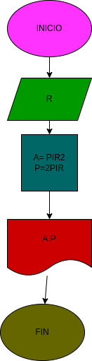

# Ejercicio No.1

## calcular el area y el perimetro del circulo r

# ANALISIS

variable de entrada (imput)

R:Radio del circulo

variable del proceso y salida (processing, strorang, outout)

A:Area del circulo
P:Perimetro del circulo

# DISEÑO

# CONSTRUCCION